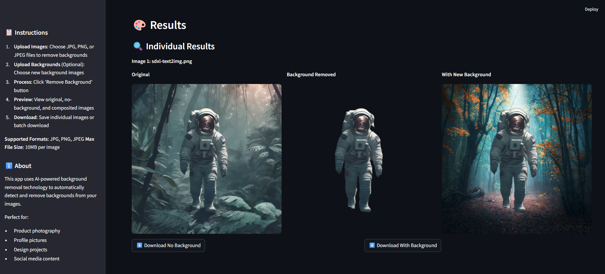

# BackgroundEraser



This project is a Streamlit app designed to remove backgrounds from images.

## Prerequisites

- Python 3.8 or higher
- pip (Python package installer)

## Installation

1. Clone the repository:
   ```bash
   git clone https://github.com/yourusername/BackgroundEraser.git
   cd BackgroundEraser
   ```

2. Create a virtual environment (optional but recommended):
   ```bash
   python -m venv venv
   source venv/bin/activate  # On Windows, use `venv\Scripts\activate`
   ```

3. Install the required dependencies:
   ```bash
   pip install -r requirements.txt
   ```

## Usage

1. Place your images in the `input` directory.
2. Run the Streamlit app:
   ```bash
   streamlit run app.py
   ```
3. The app will open in your default web browser, where you can upload images and process them.

## Example

```bash
# Example command to run the Streamlit app
streamlit run app.py
```

## License

This project is licensed under the MIT License - see the LICENSE file for details. 